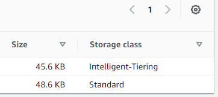

# Data Retention Policies in S3

Storage Classes are storage configuration applied to individual files within an S3 bucket. When a file is switched between storage classes  (manually or automatically), the only visible difference is that its "Storage Class" property changes:

There are many storage classes, as described [here](https://aws.amazon.com/s3/storage-classes/), but in general, Intelligent Tiering is the best for reducing general costs for unknown access patterns.